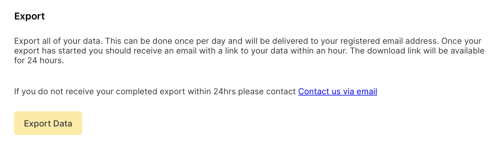

# Omnivore to DEVONthink Importer

A script to import [Omnivore](https://omnivore.app/) articles into [DEVONthink 3](https://www.devontechnologies.com/apps/devonthink).

On October 30th, [Omnivore team announced they will shutdown](https://blog.omnivore.app/p/details-on-omnivore-shutting-down) their free-hosted service on November 30th. Until the shutdown, you can download your entire Omnivore library in the form of a zip archive. This script imports articles (in Web Archive format) and highlights (in Markdown format) to DEVONthink's Global Inbox.

## Prerequisites

- macOS
- DEVONthink 3
- Omnivore export files (unzipped)

## Features

- Imports articles and highlights from Omnivore export to DEVONthink 3
- Creates articles as web archives to preserve all resources
- Uses a two-step process to import:
  - Creates temporary HTML record with proper URL
  - Converts to web archive to capture all resources
- Preserves metadata:
  - Title
  - URL
  - Description (as comment)
  - Tags/Labels
  - Publication date
- Articles are tagged as "Omnivore"
- Highlights are tagged as "Highlight" in addition to "Omnivore"

## Usage

1. Export your library from Omnivore
   - Go to Settings > Account > Export > Export Data
   - Download and unzip the export file
   

2. Run the script
   - Open the script (`omnivore-to-devonthink.scpt`) in Script Editor
   - Click Run
   - Select the unzipped Omnivore export folder when prompted
   - Wait for the import to complete (this takes a bit long due to capture all resources)

## Files
   - `omnivore-to-devonthink.applescript`: Source code version (for development)
   - `omnivore-to-devonthink.scpt`: Compiled version (for use)

   Users can either:
   - Download and run the .scpt file directly
   - Open the .applescript file in Script Editor and save/run it

## License

MIT License

## Credits

- Originally created by Rino
- This script is created with extensive support of Anthropic's Claude 3.5 Sonnet.
